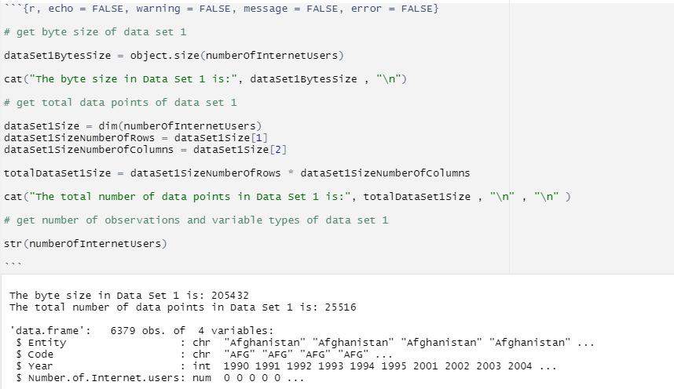

```{r setup, include = FALSE}

library(ISLR)
library(MASS)
library(tidyr)
library(tidyverse)
library(ggplot2)
library(ggthemes)
library(gganimate)
library(ggrepel)
library(dplyr)
library(tidyverse)
library(ggmap)
library(maps)
library(mapdata) 
library(knitr)
library(kableExtra)
library(countrycode)

getwd()

knitr::opts_chunk$set(echo = TRUE)
```


### **Introduction** 

As technology rapidly develops around the world, the Internet is is an indespensible factor in the majority of people's daily lives as it has created a multitude of opportunities and revolutionised the way we learn, work and communicate. Although most of us use the Internet regularly, it is important to recognise that only 60% of the world's population is present online in 2020. 

This report explores the collected data related to the global population's exposure to the Internet. The collected data are analysed to gain valuable insights into factors that may contribute to the technological discrepancies; these may be due to socioeconomic factors, geographical regions or political agendas.     

Research Questions:     
- What are the factors that contribute and have effects on the region's/country's Internet usage?      
- Did COVID-19 affect the world's Internet usage and digital connectivity?      


---

### **Data Set Introduction** 

The following report contains 3 different data sets collected from [Our World in Data - Internet](https://ourworldindata.org/internet) (Our World in Data, n.d.). The first data set explores the Number of Internet Users around the world, the second data set provides information on the proportion of individuals using the Internet and the last set focuses on the number of landline Internet subscriptions.      

**Data Set 1** contains variables: 'Entity', 'Code', 'Year' and 'Number of Internet Users'

```{r, echo = FALSE, warning = FALSE, message = FALSE, error = FALSE}

# read in data of Number of Internet Users 

numberOfInternetUsers = read.csv('number-of-internet-users.csv')

# get variables from data set 

dataSet1Variables = names(numberOfInternetUsers)

numberOfInternetUsersVariables = data.frame(Variables = dataSet1Variables)

# display variables using kable()

kable(numberOfInternetUsersVariables, format = "html", align = "c") %>%
  kable_styling(bootstrap_options = c("striped", "hover"), full_width = FALSE)

```


**Data Set 2** contains variables: 'Entity', 'Code', 'Year' and 'Individuals using the Internet (% of population)'    

```{r, echo = FALSE, warning = FALSE, message = FALSE, error = FALSE}

# read in data of Individuals using the Internet  

individualsUsingInternet = read.csv('share-of-individuals-using-the-internet.csv')

# get variables from data set 

dataSet2Variables = names(individualsUsingInternet)

individualsUsingInternetVariables = data.frame(Variables = dataSet2Variables)

# display variables using kable()

kable(individualsUsingInternetVariables, format = "html", align = "c") %>%
  kable_styling(bootstrap_options = c("striped", "hover"), full_width = FALSE)

```


**Data Set 3** contains variables: 'Entity', 'Code', 'Year' and 'Fixed Broadband Subscriptions'     

```{r, echo = FALSE, warning = FALSE, message = FALSE, error = FALSE}

# read in data of Landline Internet Subscriptions

landlineInternetSubscriptions = read.csv('landline-internet-subscriptions.csv')

# get variables from data set 

dataSet3Variables = names(landlineInternetSubscriptions)

landlineInternetSubscriptionsVariables = data.frame(Variables = dataSet3Variables)

# display variables using kable()

kable(landlineInternetSubscriptionsVariables, format = "html", align = "c") %>%
  kable_styling(bootstrap_options = c("striped", "hover"), full_width = FALSE)

```


---

### **Data Set Description**    

**Data Set 1** contains 25,516 total data points, 6,379 observations and is 205,432 in bytes size. It overall has 4 variables: 2 of them are Character variables ('Entity' and 'Code'), 1 is an Integer variable ('Year') and 1 is a Numeric variable ('Number of Internet Users').         

```{r, echo = FALSE, warning = FALSE, message = FALSE, error = FALSE}

# get byte size of data set 1 

dataSet1BytesSize = object.size(numberOfInternetUsers) 

cat("The byte size in Data Set 1 is:", dataSet1BytesSize , "\n")

# get total data points of data set 1

dataSet1Size = dim(numberOfInternetUsers)
dataSet1SizeNumberOfRows = dataSet1Size[1]
dataSet1SizeNumberOfColumns = dataSet1Size[2]

totalDataSet1Size = dataSet1SizeNumberOfRows * dataSet1SizeNumberOfColumns

cat("The total number of data points in Data Set 1 is:", totalDataSet1Size , "\n" , "\n" )

# get number of observations and variable types of data set 1 

str(numberOfInternetUsers)

```

```{r, echo = FALSE}

# image attached of code and output of data set 1 



```

---     

**Data Set 2** contains 26,132 total data points, 6,533 observations and is 210,248 in bytes size. It overall has 4 variables: 2 of them are Character variables ('Entity' and 'Code'), 1 is an Integer variable ('Year') and 1 is a Numeric variable ('Individuals using the Internet (% of population)').       

```{r, echo = FALSE, warning = FALSE, message = FALSE, error = FALSE}

# get size of data set 2

dataSet2BytesSize = object.size(individualsUsingInternet) 

cat("The byte size in Data Set 2 is:", dataSet2BytesSize , "\n")

# get total data points of data set 2

dataSet2Size = dim(individualsUsingInternet)
dataSet2SizeNumberOfRows = dataSet2Size[1]
dataSet2SizeNumberOfColumns = dataSet2Size[2]

totalDataSet2Size = dataSet2SizeNumberOfRows * dataSet2SizeNumberOfColumns

cat("The total number of data points in Data Set 2 is:", totalDataSet2Size , "\n" , "\n")

# get number of observations and variable types of data set 2

str(individualsUsingInternet)

```

```{r, echo = FALSE}

# image attached of code and output of data set 2 


```

---    

**Data Set 3** contains 15,576 total data points, 3,894 observations and is 135,568 in bytes size. It overall has 4 variables: 2 of them are Character variables ('Entity' and 'Code'), 1 is an Integer variable ('Year') and 1 is a Numeric variable ('Fixed Broadband Subscriptions').       

```{r, echo = FALSE, warning = FALSE, message = FALSE, error = FALSE}

# get size of data set 3

dataSet3BytesSize = object.size(landlineInternetSubscriptions) 

cat("The byte size in Data Set 3 is:", dataSet3BytesSize , "\n")

# get total data points of data set 3

dataSet3Size = dim(landlineInternetSubscriptions)
dataSet3SizeNumberOfRows = dataSet3Size[1]
dataSet3SizeNumberOfColumns = dataSet3Size[2]

totalDataSet3Size = dataSet3SizeNumberOfRows * dataSet3SizeNumberOfColumns

cat("The total number of data points in Data Set 3 is:", totalDataSet3Size , "\n" , "\n")

# get number of observations and variable types of data set 3

str(landlineInternetSubscriptions)

```

```{r, echo = FALSE}

# image attached of code and output of data set 3 


```

---

### **Data Summary**     

#### Table 1 - Data Set 1    

```{r, echo = FALSE, warning = FALSE, message = FALSE, error = FALSE}

options(scipen = 999)

# 1990 data
year1990 = 1990 
filtered1990 = numberOfInternetUsers[numberOfInternetUsers $ Year == year1990, ]

summary1990NumberOfInternetUsers = summary(filtered1990 $ Number.of.Internet.users)

summary1990array = as.array(summary1990NumberOfInternetUsers)

summary1990data = data.frame(Statistics = rownames(summary1990array), Values = summary1990array, stringsAsFactors = FALSE)

# 2000 data 
year2000 = 2000 
filtered2000 = numberOfInternetUsers[numberOfInternetUsers $ Year == year2000, ]

summary2000NumberOfInternetUsers = summary(filtered2000 $ Number.of.Internet.users)

summary2000array = as.array(summary2000NumberOfInternetUsers)

summary2000data = data.frame(Statistics = rownames(summary2000array), Values = summary2000array, stringsAsFactors = FALSE)

# 2010 data 
year2010 = 2010 
filtered2010 = numberOfInternetUsers[numberOfInternetUsers $ Year == year2010, ]

summary2010NumberOfInternetUsers = summary(filtered2010 $ Number.of.Internet.users)

summary2010array = as.array(summary2010NumberOfInternetUsers)

summary2010data = data.frame(Statistics = rownames(summary2010array), Values = summary2010array, stringsAsFactors = FALSE)

# 2020 data 
year2020 = 2020 
filtered2020 = numberOfInternetUsers[numberOfInternetUsers $ Year == year2020, ]

summary2020NumberOfInternetUsers = summary(filtered2020 $ Number.of.Internet.users)

summary2020array = as.array(summary2020NumberOfInternetUsers)

summary2020data = data.frame(Statistics = rownames(summary2020array), Values = summary2020array, stringsAsFactors = FALSE)

combinedSummary = bind_cols(summary1990data$Statistics,summary1990data$Values.Freq, summary2000data$Values.Freq, summary2010data$Values.Freq, summary2020data$Values.Freq)

colnames(combinedSummary) = c("Statistics", "1990", "2000", "2010", "2020")

kable(combinedSummary, format = "html", align = "c") %>% kable_styling(bootstrap_options = c("striped", "hover"), full_width = FALSE)

```

**Table 1** provides the summary data for the years 1990, 2000, 2010 and 2020 based on the Number of Internet Users around the world.    

The Minimum row presents the number of Internet users was 0 for 1990, 2000, and 2010. However in 2020, there was a significant increase showcasing a Minimum of 48,060 Internet users. This jump suggests a substantial growth in Internet users between 2010 and 2020, indicating the expansion and adoption of Internet.    


---

#### Table 2 - Data Set 3

```{r, echo = FALSE, warning = FALSE, message = FALSE, error = FALSE}
options(scipen = 999)

# 2000 data
year2000 = 2000 
filtered2000 = landlineInternetSubscriptions[landlineInternetSubscriptions $ Year == year2000, ]

summary2000landlineInternetSubscriptions = summary(filtered2000 $ Fixed.broadband.subscriptions)

summary2000array = as.array(summary2000landlineInternetSubscriptions)

summaryyear2000data = data.frame(Statistics = rownames(summary2000array), Values = summary2000array, stringsAsFactors = FALSE)

# 2005 data
year2005 = 2005 
filtered2005 = landlineInternetSubscriptions[landlineInternetSubscriptions $ Year == year2005, ]

summary2005landlineInternetSubscriptions = summary(filtered2005 $ Fixed.broadband.subscriptions)

summary2005array = as.array(summary2005landlineInternetSubscriptions)

summaryyear2005data = data.frame(Statistics = rownames(summary2005array), Values = summary2005array, stringsAsFactors = FALSE)

# 2010 data
year2010 = 2010 
filtered2010 = landlineInternetSubscriptions[landlineInternetSubscriptions $ Year == year2010, ]

summary2010landlineInternetSubscriptions = summary(filtered2010 $ Fixed.broadband.subscriptions)

summary2010array = as.array(summary2010landlineInternetSubscriptions)

summaryyear2010data = data.frame(Statistics = rownames(summary2010array), Values = summary2010array, stringsAsFactors = FALSE)

# 2015 data
year2015 = 2015 
filtered2015 = landlineInternetSubscriptions[landlineInternetSubscriptions $ Year == year2015, ]

summary2015landlineInternetSubscriptions = summary(filtered2015 $ Fixed.broadband.subscriptions)

summary2015array = as.array(summary2015landlineInternetSubscriptions)

summaryyear2015data = data.frame(Statistics = rownames(summary2015array), Values = summary2015array, stringsAsFactors = FALSE)

# 2020 data
year2020 = 2020 
filtered2020 = landlineInternetSubscriptions[landlineInternetSubscriptions $ Year == year2020, ]

summary2020landlineInternetSubscriptions = summary(filtered2020 $ Fixed.broadband.subscriptions)

summary2020array = as.array(summary2020landlineInternetSubscriptions)

summaryyear2020data = data.frame(Statistics = rownames(summary2020array), Values = summary2020array, stringsAsFactors = FALSE)

combineSummary = bind_cols(summaryyear2000data$Statistics,summaryyear2000data$Values.Freq, summaryyear2005data$Values.Freq, summaryyear2010data$Values.Freq, summaryyear2015data$Values.Freq, summaryyear2020data$Values.Freq)

colnames(combineSummary) = c("Statistics", "2000", "2005", "2010", "2015", "2020")

kable(combineSummary, format = "html", align = "c") %>% kable_styling(bootstrap_options = c("striped", "hover"), full_width = FALSE)

```

**Table 2** presents the summary data for the years 2000, 2005, 2010, 2015 and 2020 based on the number of Landline Internet Subscriptions globally. 

It is interesting to note that the Minimum values decreased between 2000 and 2005 as well as between 2015 and 2020. Similarly, the 25th percentile (1st Quartile) values from 2000 to 2005 also experienced a downward trend. This decline can be attributed to the improvements of Internet infrastructures, such as advancements like broadband and WIFI connections. These new structures allow for faster access and connection to the Internet, which may have resulted in the decrease of landline Internet subscriptions in these time periods. 

---

### **Visualisations**      

#### Figure 1

```{r, echo = FALSE}

options(scipen = 999)

selectedEntitiesNumberOfInternetUsers = c("World", "Africa", "Asia", "Europe", "North America", "South America", "Oceania")

numberOfInternetUsersEntities = numberOfInternetUsers %>% filter(Entity %in% selectedEntitiesNumberOfInternetUsers)

a = ggplot(numberOfInternetUsersEntities, aes(x = Year, y = Number.of.Internet.users, group = Entity, color = Entity)) + geom_line() + geom_point() + labs(x = "Year", y = "Number of Internet users") + theme_minimal()

a

```

<i>Figure 1</i> presents the number of people who have used the Internet in the past 3 months. The variables have been sub-divided into geographical locations to demonstrate a more thorough analysis on the increase of Internet users. 

- The variable 'World' presents as the highest number of Internet users as it calculates the total globally. The graph shows the region 'Asia' with the highest number of Internet users. This is consistent from the year 2002 as 'Asia' surpassed the region 'North America' in Internet users, with 212.70 million and 205.26 million users respectively. Before 2002, the region 'North America' had the leading number of Internet users. Furthermore, in 2003, the geographical region 'Europe' also surpassed 'North America' with 227.61 million and 218.60 million Internet users respectively. 

- In 2020, 'Asia' recorded an impressive 2.55 billion Internet users, accounting for 54% of the global total represented by the 'World' variable, which stood at 4.70 billion users. This highlights the significant presence of 'Asia' in the global Internet landscape. Moreover, since 2006, 'Asia' has experienced rapid growth in Internet users, surpassing the growth rates of other geographical regions.

- The region 'Oceania' shows the lowest growth in Internet users compared to other regions. This could be attributed to the smaller populations of Pacific islands within this region, which may limit the overall growth of Internet usage.

- It is worth noting a significant surge in Internet users from 2019 to 2020, particularly when considering the 'World' entity. This notable increase can be attributed to various factors, with the COVID-19 pandemic playing a significant role. The global outbreak prompted many countries to implement work from home measures and social distancing protocols, leading to a substantial rise in Internet usage.


---


#### Figure 2

```{r, echo = FALSE}

options(scipen = 999)

excludedEntities = c("World", "Asia", "Upper-middle-income countries", "Lower-middle-income countries", "High-income countries", "Europe", "North America", "Africa", "South America", "Low-income countries", "United Kingdom")

df2020Filtered = filter(numberOfInternetUsers, Year == 2020 & !(Entity %in% excludedEntities))

topCountryEntities = df2020Filtered %>% group_by(Entity) %>% summarize(Total = sum(Number.of.Internet.users))

topCountryEntities = arrange(topCountryEntities, desc(Total))

top15CountryEntities = head(topCountryEntities, 15)

b = ggplot(top15CountryEntities, aes(x = Entity, y = Total, color = Entity)) + geom_bar(stat = "identity", fill = "white") + labs(title = "Top 15 Countries by Number of Internet Users in 2020", x = "Countries", y = "Total Internet Users") + theme_minimal() + scale_x_discrete(guide = guide_axis(n.dodge = 2)) + NULL

b

```

<i>Figure 2</i> showcases the top 15 countries with the highest number of Internet users in 2020.

- China takes the lead, followed by India in second place and the United States in third. This ranking highlights the influence of population density on the number of Internet users, with highly populous countries such as China and India claiming the top positions.

- China's position at the top of the list can be attributed to its enormous population, which naturally leads to a larger user base. Similarly, India's second-place ranking is also a reflection of its substantial population size. The United States is known for its technological advancements and widespread Internet accessibility. They secured a prominent position in the ranking despite having a smaller population compared to China and India.

- The data shows the significance of population size when examining the number of Internet users in each country. Countries with larger populations are more likely to have a higher number of Internet users as the potential user base is larger.


---


#### Figure 3

```{r, echo = FALSE}

options(scipen = 999)

excludedEntities = c("World", "Asia", "Upper-middle-income countries", "Lower-middle-income countries", "High-income countries", "Europe", "North America", "Africa", "South America", "Low-income countries", "United Kingdom")

df2020Filtered = filter(numberOfInternetUsers, Year == 2020 & !(Entity %in% excludedEntities))

topCountryEntities = df2020Filtered %>% group_by(Entity) %>% summarize(Total = sum(Number.of.Internet.users))

topCountryEntities = arrange(topCountryEntities, desc(Total))

top15CountryEntities = tail(topCountryEntities, 15)

c = ggplot(top15CountryEntities, aes(x = Entity, y = Total, color = Entity)) + geom_bar(stat = "identity", fill = "white") + labs(title = "Bottom 15 Countries by Number of Internet Users in 2020", x = "Countries", y = "Total Internet Users") + theme_minimal() + scale_x_discrete(guide = guide_axis(angle = 30)) + NULL

c

```

The bar graph displays the bottom 15 countries in terms of Internet usage in 2020. These countries appear in this ranking due to their smaller population sizes, which directly impacts the overall frequency of Internet usage.

- The graph highlights the correlation between population size and Internet usage, as countries with smaller populations tend to have lower rates of Internet adoption. Consequently, these countries find themselves in the lower positions of the ranking.


---


#### Figure 4

```{r, echo = FALSE}

options(scipen = 999)

selectedDemographic = c("Upper-middle-income countries", "Lower-middle-income countries", "High-income countries", "Low-income countries")

numberOfInternetUsersDemographic = numberOfInternetUsers %>% filter(Entity %in% selectedDemographic)

d = ggplot(numberOfInternetUsersDemographic, aes(x = Entity, y = Number.of.Internet.users, color = Entity)) + geom_boxplot(fill = "white") + labs(title = "Boxplot of Number of Internet Users by Sociodemographic", x = "Sociodemographic", y = "Number of Internet Users") + theme_minimal() + scale_x_discrete(guide = guide_axis(n.dodge = 2)) + NULL

d

```

<i>Figure 4</i> consists of four boxplots, representing different socioeconomic backgrounds: High Income Countries, Low Income Countries, Lower Middle Income Countries, and Upper Middle Income Countries.

- The Upper Middle Income Countries exhibits the largest range in terms of the socioeconomic variables being analysed. This indicates a wider variation within this group, containing countries with diverse economic conditions and developments.

- The boxplot for High Income Countries reveals the highest median among the four groups. This suggests that, on average, countries classified as High Income have higher values for the socioeconomic variables compared to the other categories.


---


#### Figure 5

```{r, echo = FALSE}

options(scipen = 999)

selectedEntitiesIndividualsUsingInternet = c("World", "Sub-Saharan Africa", "South Asia", "East Asia and Pacific", "Latin America and Caribbean", "Middle East and North Africa", "Europe and Central Asia", "North America")

individualsUsingInternetEntities = individualsUsingInternet %>% filter(Entity %in% selectedEntitiesIndividualsUsingInternet)

e = ggplot(individualsUsingInternetEntities, aes(x = Year, y = Individuals.using.the.Internet....of.population., group = Entity, color = Entity)) + geom_line() + geom_point() + labs(x = "Year", y = "Percentage of the Population using the Internet") + theme_minimal()

e

```

The line chart illustrates the percentage of population engaging in Internet usage within the past 3 months. The 'World' entity serves as the reference point for the standard percentage of Internet usage. From the chart, we can observe that entities such as 'North America', 'Europe and Central Asia', 'Middle East and North Africa', 'Latin America and Caribbean', and 'East Asia and Pacific' surpass the 'World' standard in terms of Internet usage.

- A notable factor contributing to the high percentage in 'Europe and Central Asia' is the significant population density in this region, particularly due to countries like China. As previously mentioned, China stands out as the country with the highest number of Internet users globally. This prevalence of Internet usage in China contributes to the relatively high percentage observed in the 'Europe and Central Asia' entity.

- By examining the deviations from the 'World' standard across different regions, we gain insights into the varying levels of Internet adoption and usage worldwide. 


---


#### Figure 6

```{r, echo = FALSE}

chosenEntitiesIndividualsUsingInternet = c("Sub-Saharan Africa", "South Asia", "East Asia and Pacific", "Latin America and Caribbean", "Middle East and North Africa", "Europe and Central Asia", "North America")

chosensUsingInternetEntities = individualsUsingInternet %>% mutate(Individuals.using.the.Internet....of.population. = Individuals.using.the.Internet....of.population. / sum(Individuals.using.the.Internet....of.population.) * 100) %>% filter(Entity %in% chosenEntitiesIndividualsUsingInternet)

f = ggplot(chosensUsingInternetEntities, aes(x = Year, y = Individuals.using.the.Internet....of.population., group = Entity, color = Entity)) + geom_bar(position = "fill", stat = "identity", fill = "white") + labs(x = "Year", y = "", title = "Distribution of Individuals using the Internet") + theme_minimal()

f

```

The stacked bar chart provides a visual presentation of the distribution of individuals using the Internet across different regions. This chart enables us to clearly observe the transition of Internet adoption in these regions over the years.

- In 1990, 'North America' emerges as the dominant region in terms of Internet usage. However overtime, the distribution gradually shifts towards a more balanced allocation across regions.

- The chart's depiction of the changing distribution of Internet adoption offers valuable insights into the global landscape of connectivity. It highlights the progress made by various regions in embracing and incorporating Internet technologies into their societies.


---


#### Figure 7 

```{r, echo = FALSE, warning = FALSE, message = FALSE, error = FALSE}

options(scipen = 999)

landlineInternetSubscriptions2020 = filter(landlineInternetSubscriptions, Year == 2020)

worldMap = map_data("world")
# convert full country names to ISO 3166-1 alpha-3 country codes
worldMap$iso3c = countrycode(worldMap$region, 'country.name', 'iso3c')

# then perform the left join using the converted codes
landlineInternetSubscriptions2020Map = left_join(worldMap, landlineInternetSubscriptions2020, by = c("iso3c" = "Code"))

g = ggplot() + geom_map(data = landlineInternetSubscriptions2020Map, map = landlineInternetSubscriptions2020Map, aes(x = long, y = lat, map_id = region, fill = Fixed.broadband.subscriptions), color = "black") + coord_equal() + theme_void() + scale_fill_gradient(low = "white", high = "darkred", name = "Fixed Broadband Subscriptions") + labs(title = "Fixed Broadband Subscriptions by Country in 2020")

g

```

The heat map provides a visual representation of the global distribution of fixed broadband subscriptions among countries. 

- In 2020, China emerges as the clear leader, sitting at 483.55 million fixed broadband subscriptions. This remarkable figure indicates the country's dominance in terms of broadband adoption, with no other country coming close to matching its number of subscriptions.

- While several countries such as the United States (121.18 million), Brazil (36.34 million), Germany (36.22 million) and Russia (33.89 million) exhibit substantial subscription numbers, they are still considerably low when compared to China's vast number of subscriptions.


---


#### Figure 8

```{r, echo = FALSE, warning = FALSE, message = FALSE, error = FALSE}

options(scipen = 999)

landlineInternetSubscriptions2005 = filter(landlineInternetSubscriptions, Year == 2005)

worldMap $ iso3c = countrycode(worldMap$region, 'country.name', 'iso3c')

landlineInternetSubscriptions2005Map = left_join(worldMap, landlineInternetSubscriptions2005, by = c("iso3c" = "Code"))

h = ggplot() + geom_map(data = landlineInternetSubscriptions2005Map, map = landlineInternetSubscriptions2005Map, aes(x = long, y = lat, map_id = region, fill = Fixed.broadband.subscriptions), color = "black") + coord_equal() + theme_void() + scale_fill_gradient(low = "white", high = "darkred", name = "Fixed Broadband Subscriptions") + labs(title = "Fixed Broadband Subscriptions by Country in 2005")

h

```

<i>Figure 8</i> showcases the global fixed broadband subscription in the year 2005, highlighting the number of subscriptions by country. 

- In 2005, the United States claims the top position with the highest number of fixed broadband subscriptions, reaching 51.16 million subscriptions. China also holds a significant position in the ranking, with 37.35 million subscriptions.

- This data reflects the prominence of the United States and China in terms of fixed broadband adoption in 2005. The United States, known for its technological advancements and infrastructure, demonstrates a strong presence of Internet subscriptions. Similarly, China's growing economy and population contribute to its high number of fixed broadband subscriptions during that period.


---


#### Figure 9

```{r, echo = FALSE}

options(scipen = 999)

chosenDemographics = c("World", "High income", "Low and middle income", "Low income", "Lower middle income", "Middle income", "Upper middle income")

chosenDemographicsLandlineInternetSubscriptions = landlineInternetSubscriptions %>% filter(Entity %in% chosenDemographics)

i = ggplot(chosenDemographicsLandlineInternetSubscriptions, aes(x = Year, y = Fixed.broadband.subscriptions, color = Entity)) + geom_line() + labs(title = "Trend of Fixed Broadband Subscriptions", x = "Year", y = "Number of Fixed Broadband Subscriptions") + theme_minimal()

i

```

The line chart presents the distribution of fixed broadband subscriptions across different sociodemographic categories, including High Income, Low and Middle Income, Low Income, Lower Middle Income, Middle Income, and Upper Middle Income.

- The chart reveals that the Middle Income demographic exhibits the highest number of fixed broadband subscriptions, followed by the Upper Middle Income category in the second position. This observation suggests that countries falling within these income brackets have a higher level of adoption and access to fixed broadband services.

- It is worth recognising that while the High Income demographic is traditionally associated with greater wealth, the population size may be smaller in comparison to the Middle Income and Upper Middle Income groups. Consequently, the overall number of fixed broadband subscriptions within the High Income category is relatively lower than those of the Middle Income and Upper Middle Income categories due to the smaller population size.

---


#### Figure 10

```{r, echo = FALSE}

options(scipen = 999)

excludedChosenDemographics = c("World", "High income", "Low and middle income", "Low income", "Lower middle income", "Middle income", "Upper middle income", "East Asia and Pacific", "Europe and Central Asia", "European Union", "Latin America and Caribbean", "North America", "Middle East and North Africa", "United Kingdom")

dfExcludedChosenDemographicsLandlineInternetSubscriptions = filter(landlineInternetSubscriptions, !(Entity %in% excludedChosenDemographics))

topChosenDemographics = dfExcludedChosenDemographicsLandlineInternetSubscriptions %>% group_by(Entity) %>% summarize(Total = sum(Fixed.broadband.subscriptions))

topChosenDemographics = arrange(topChosenDemographics, desc(Total))

top15ChosenDemographics = head(topChosenDemographics, 15)

j = ggplot(top15ChosenDemographics, aes(x = Entity, y = Total, color = Entity)) + geom_bar(stat = "identity", fill = "white") + labs(title = "Top 15 Countries by Overall Fixed Broadband Subscriptions", x = "Countries", y = "Total Fixed Broadband Subscriptions") + theme_minimal() + scale_x_discrete(guide = guide_axis(n.dodge = 2)) + NULL

j

```

<i>Figure 10</i> showcases the top 15 countries with the highest fixed broadband subscriptions. 

- With its vast population, China leads the list with the highest number of fixed broadband subscriptions. The United States and Japan, renowned for their technological advancements and innovation-driven societies, also demonstrate a strong presence in fixed broadband subscriptions.


---


#### Figure 11

```{r, echo = FALSE}

options(scipen = 999)

excludedChosenDemographics = c("World", "High income", "Low and middle income", "Low income", "Lower middle income", "Middle income", "Upper middle income", "East Asia and Pacific", "Europe and Central Asia", "European Union", "Latin America and Caribbean", "North America", "Middle East and North Africa", "United Kingdom")

dfExcludedChosenDemographicsLandlineInternetSubscriptions = filter(landlineInternetSubscriptions, !(Entity %in% excludedChosenDemographics))

topChosenDemographics = dfExcludedChosenDemographicsLandlineInternetSubscriptions %>% group_by(Entity) %>% summarize(Total = sum(Fixed.broadband.subscriptions))

topChosenDemographics = arrange(topChosenDemographics, desc(Total))

top15ChosenDemographics = tail(topChosenDemographics, 15)

k = ggplot(top15ChosenDemographics, aes(x = Entity, y = Total, color = Entity)) + geom_bar(stat = "identity", fill = "white") + labs(title = "Bottom 15 Countries by Overall Fixed Broadband Subscriptions", x = "Countries", y = "Total Fixed Broadband Subscriptions") + theme_minimal() + scale_x_discrete(guide = guide_axis(angle = 30)) + NULL

k

```

The bar chart presented in <i>Figure 11</i> presents the lowest 15 countries in terms of fixed broadband subscription. 

- These countries exhibit a major contrast when compared to the previous chart, primarily due to their limited number of subscriptions, which is below 20,000. This disparity can be attributed to several factors, including the overall economic prosperity and the countries' capacity to provide widespread access to fixed broadband services.

- A significant portion of the countries shown in this graph are located in Sub-Saharan Africa. Despite the relatively large populations of countries like the Central African Republic, Congo, and South Sudan, their limited fixed broadband subscription numbers can be attributed to factors such as economic stability and political circumstances, which impact their ability to provide widespread access to broadband services.

- Additionally, the presence of small Pacific islands like Nauru, Tuvalu, Palau, and others also affects their subscription rates due to their limited population size and geographical constraints.


---


#### Figure 12

```{r, echo = FALSE}

options(scipen = 999)

includedEntities = c("World", "Sub-Saharan Africa", "South Asia", "East Asia and Pacific", "Latin America and Caribbean", "Middle East and North Africa", "Europe and Central Asia", "North America")

landlineInternetSubscriptionsIncludedEntities = landlineInternetSubscriptions %>% filter(Entity %in% includedEntities)

l = ggplot(landlineInternetSubscriptionsIncludedEntities, aes(x = Year, y = Fixed.broadband.subscriptions, group = Entity, color = Entity)) + geom_line() + geom_point() + labs(title = "Relationship between Year and Fixed Broadband Subscriptions", x = "Year", y = "Number of Fixed Broadband Subscriptions") + theme_minimal()

l

```

The line chart illustrates the growth of fixed broadband subscriptions across regions, revealing that Sub-Saharan Africa experiences comparatively lower growth. 

- This discrepancy can be attributed to the region's overall economic conditions, impacting its ability to invest in and develop broadband infrastructure. 


--- 


### **Conclusion** 

This report has explored various aspects of Internet usage and connectivity across different regions and socioeconomic backgrounds.The data reveals disparities in Internet adoption based on factors such as geographic location, population size, and socioeconomic conditions. While some regions and countries exhibit high rates of Internet usage, there are still many countries that have limited access to the Internet. 

The analysis shows the influence of factors such as population size and economic development on Internet usage. Countries with larger populations tend to have higher numbers of Internet users, while regions with stronger economies demonstrate higher levels of connectivity.

COVID-19 also had a big impact on Internet usage, with a noticeable increase seen in several areas. Due to the pandemic, people are able to access the Internet more frequently because of remote work and online education.

The report highlights the importance of understanding and addressing the disparities in Internet usage across regions and socioeconomic backgrounds.


--- 


### **Reference** 

H, Ritchie., E, Mathieu., M, Roser., and E, Ortiz-Ospina. (2023). <i>Internet</i>. OurWorldInData. https://ourworldindata.org/internet    

